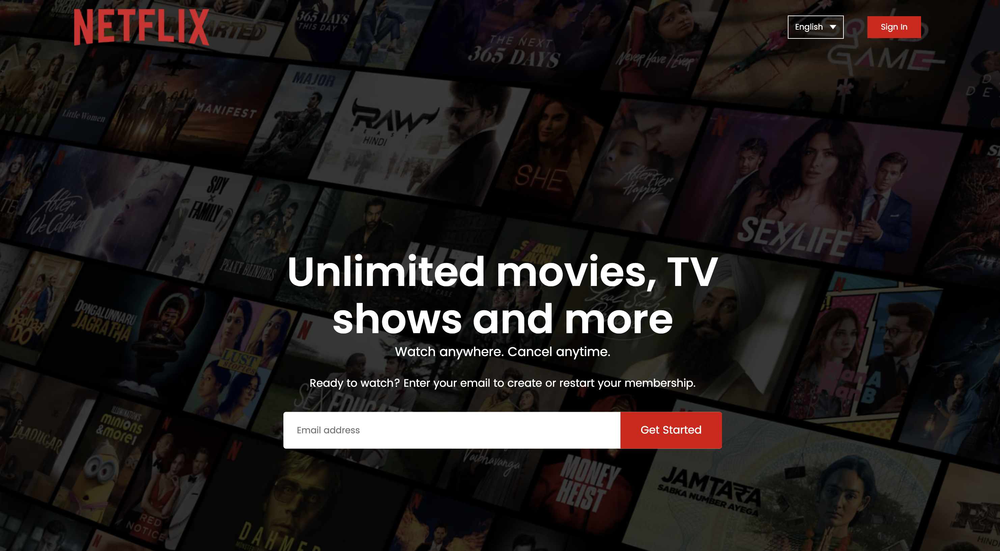
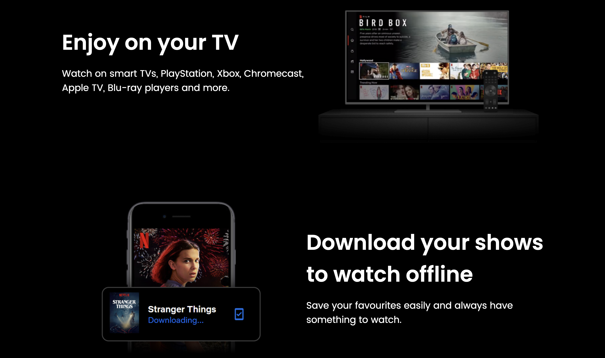
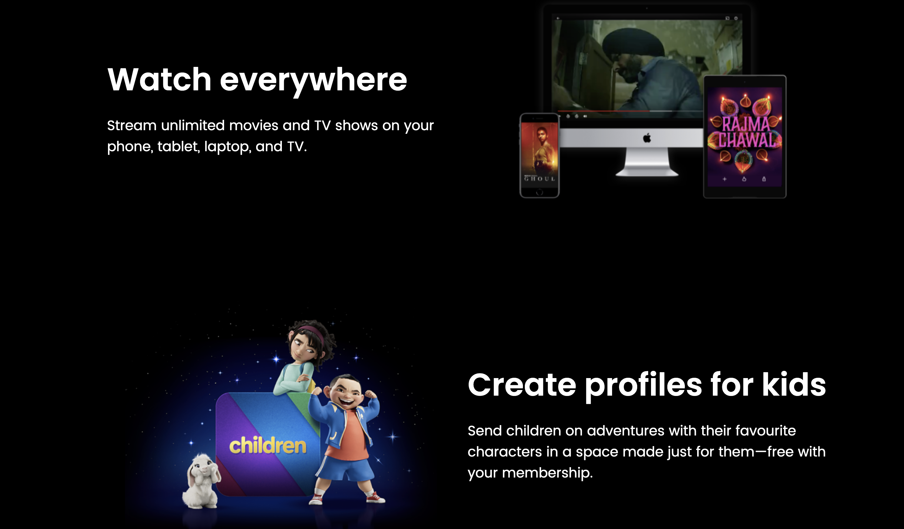

# Netflix Landing Page 🎬

The **Netflix Landing Page** is a front-end clone of the official Netflix homepage, built to practice responsive UI design and layout techniques. It uses HTML, CSS, and JavaScript to replicate the dark-themed, media-rich feel of the original Netflix landing experience.

---

## 🌟 Features

- **Responsive Design**: Fully responsive layout using Flexbox and Media Queries to adapt across devices.
- **Hero Section**: Includes Netflix-style background banner with headline and call-to-action.
- **Navigation Bar**: Clean top navigation menu resembling Netflix’s original layout.
- **Subscription Form**: Simple email input form to simulate user sign-up.
- **Dark Theme**: Inspired by Netflix’s signature black-and-red UI theme.
- **Smooth Styling**: CSS transitions for enhanced UI aesthetics.

---

## 🛠️ Technologies Used

### Frontend:
- HTML5
- CSS3
- JavaScript (optional for interactivity)

### Styling Frameworks:
- Custom CSS
- Flexbox
- Media Queries

> 💡 _SASS or Bootstrap not used in this project, but could be integrated for future scalability._

---

## 🖥️ Development Environment

- Code Editor: VS Code
- Browser: Chrome/Firefox
- Deployment: Local or GitHub Pages

---

## ⚙️ Installation & Setup

1. **Clone the Repository**
   ```bash
   git clone https://github.com/keerthana777z/Landing-page-.git


2. **Navigate to Project Folder**

   ```bash
   cd "Landing-page-/netflix landing page"
   ```

3. **Run Locally**
   Open `index.html` in your browser:

   * Right-click → Open with browser
   * Or use Live Server in VS Code

---

## 📸 Screenshots






---

## 🚀 Future Enhancements

* Add login/sign-up form validation with JavaScript
* Integrate backend (PHP/MySQL or Firebase) for actual user handling
* Animate UI with GSAP or AOS libraries
* Deploy live using GitHub Pages or Vercel

---

## 🤝 Contributions & Feedback

💬 *Open to ideas, suggestions, and pull requests!*
Feel free to fork the project and contribute improvements or enhancements.

---

## 📄 License

This project is licensed under the **MIT License**. See the [LICENSE](./LICENSE) file for details.

---

## 👩‍💻 Author

** AR Keerthana**
@keerthana777z

